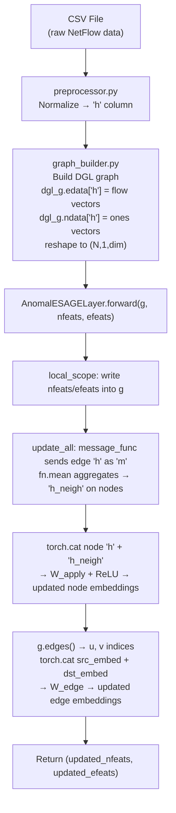

# Complete Explanation: `AnomalESAGELayer`

> This document explains every part of the `AnomalESAGELayer` class in [`e_graphsage.py`], from first principles — including DGL concepts, weight initialization math, and how data flows from preprocessing all the way into the GNN layer.

---

## Input Parameters — Quick Reference

Before reading anything else, here is what every constructor and `forward()` argument actually means in plain English, connected to your data.

### Constructor: `__init__(ndim_in, edims, ndim_out, edge_out_dim=256, activation=F.relu)`

| Parameter | Type | Concrete meaning in this project |
|---|---|---|
| `ndim_in` | `int` | Number of features **per node** coming in. Nodes have no real features — they are IP addresses. So the graph builder sets every node's feature vector to a vector of all `1`s, with length equal to the edge feature size. So `ndim_in` = number of numeric columns in your NetFlow CSV (after dropping ports and IP columns). |
| `edims` | `int` | Number of features **per edge** coming in. Edges represent network flows. Each edge carries the `'h'` vector built by the preprocessor — the normalized numeric columns (byte count, duration, packet count, TCP flags encoded as numbers, etc.). So `edims` = same number as `ndim_in` (because the paper sets node features = constant vector of same length as edge features). |
| `ndim_out` | `int` | Number of features **per node** coming out of this layer. This is a hyperparameter you choose — a typical value is `256` or `512`. It controls how rich the learned node embedding is. |
| `edge_out_dim` | `int` | Number of features **per edge** coming out of this layer. Default `256`. This is the dimension of the final edge embedding that the anomaly detector will score. |
| `activation` | `callable` | The non-linearity applied after the node update linear layer. Default is `F.relu`. |

### `forward(g_dgl, nfeats, efeats)`

| Parameter | Shape | What it holds |
|---|---|---|
| `g_dgl` | `DGLGraph` | The graph object (nodes = IPs, edges = flows). Carries the graph topology (who is connected to whom). |
| `nfeats` | `(N, 1, ndim_in)` | Node feature matrix. N = total unique IPs in this batch. The middle `1` dimension was added by `graph_builder.py`'s reshape step. |
| `efeats` | `(E, 1, edims)` | Edge feature matrix. E = total flows. Each row is one flow's normalized statistics vector — the `'h'` column from preprocessing. |

---

## 0. Before Anything: What is DGL?

**DGL (Deep Graph Library)** is a Python library that makes it easy to run neural network operations on graphs.

Think of a graph as two containers:
- `g.ndata` — a dictionary that stores **feature tensors for nodes** (like a table where rows = nodes, columns = features)
- `g.edata` — a dictionary that stores **feature tensors for edges** (same idea, but rows = edges)

Any key you write into these dictionaries (e.g. `'h'`) is just a name you choose — DGL stores and retrieves it like a regular Python dictionary, but the values are PyTorch tensors so they can participate in backpropagation.

```
g.ndata['h']  →  shape (N, 1, ndim_in)  — N nodes, each with a feature vector
g.edata['h']  →  shape (E, 1, edims)    — E edges, each with a feature vector
```

**Where does this data come from?** It comes from your pipeline:
1. [`preprocessor.py`] turns raw NetFlow CSVs into numeric vectors and stores them in a column called `'h'`.
2. [`graph_builder.py`] reads that `'h'` column and creates a DGL graph where IPs = nodes and flows = edges, and then calls `dgl_g.edata['h'] = ...` and `dgl_g.ndata['h'] = ...` to attach those vectors.

---

## 1. The Big Picture: What Does This Class Do?

`AnomalESAGELayer` is **one layer of a Graph Neural Network**. Its job is:

1. **Each edge sends its own feature vector to its destination node.**
2. **Each node collects all incoming edge features and averages them** → this is its "neighbourhood summary".
3. **Each node combines its own features with the neighbourhood summary** and passes through a learned linear transformation + activation → this is the **updated node embedding**.
4. **Each edge is then rebuilt** by combining the updated embeddings of its two endpoints (source + destination) → this is the **updated edge embedding**.

The final edge embeddings are what gets used for anomaly detection — you score each flow (edge) to decide if it's an attack.

---

## 2. `__init__`: Setting Up the Layer

```python
def __init__(self, ndim_in, edims, ndim_out, edge_out_dim=256, activation=F.relu):
    super(AnomalESAGELayer, self).__init__()
    self.W_apply = nn.Linear(ndim_in + edims, ndim_out)
    self.activation = activation
    self.W_edge  = nn.Linear(ndim_out * 2, edge_out_dim)
    self.reset_parameters()
```

### Why `super().__init__()`?
This layer inherits from `nn.Module` — PyTorch's base class for all neural network components. Calling `super().__init__()` runs `nn.Module`'s setup code, which enables things like `.parameters()`, `.to(device)`, `.train()`, `.eval()`, etc. Without it, PyTorch would not know this object is a neural network module.

### `self.W_apply = nn.Linear(ndim_in + edims, ndim_out)`

`nn.Linear(in_features, out_features)` creates a **learnable weight matrix** of shape `(out_features, in_features)` and a **learnable bias vector** of shape `(out_features,)`.

**Why `ndim_in + edims` as input size?**  
In Step 2 of the forward pass, we will *concatenate* a node's own features (`ndim_in` long) with the aggregated neighbourhood features (`edims` long — because the neighbourhood is an average of edge features). So the combined vector has length `ndim_in + edims`, which is exactly what `W_apply` must accept.

### `self.W_edge = nn.Linear(ndim_out * 2, edge_out_dim)`

In Step 3, we concatenate the updated source node embedding (`ndim_out` long) with the updated destination node embedding (`ndim_out` long). So the input to `W_edge` is `ndim_out * 2`.

### Why `nn.Linear` and not `nn.Parameter` manually?

**Great question.** You could do this:
```python
self.W = nn.Parameter(torch.empty(ndim_out, ndim_in + edims))
self.b = nn.Parameter(torch.zeros(ndim_out))
```
and then manually compute `output = input @ self.W.T + self.b`.

But `nn.Linear` does exactly the same thing — it wraps those two `nn.Parameter` objects for you internally. You can verify this:
```python
layer = nn.Linear(4, 8)
print(layer.weight)  # → nn.Parameter of shape (8, 4)
print(layer.bias)    # → nn.Parameter of shape (8,)
```
Using `nn.Linear` is preferred because:
- It handles the matrix multiply + bias for you.
- It is already registered as a submodule of your `nn.Module`, so PyTorch's optimizer automatically finds it via `.parameters()`.
- It supports GPU placement, half-precision, etc. automatically.

---

## 3. `reset_parameters`: Weight Initialization

```python
def reset_parameters(self):
    gain = nn.init.calculate_gain('relu')
    nn.init.xavier_uniform_(self.W_apply.weight, gain=gain)
    nn.init.xavier_uniform_(self.W_edge.weight, gain=gain)
```

### Why Not Leave Weights at Their Default?

`nn.Linear` initializes weights using **Kaiming Uniform** by default. `reset_parameters` *overrides* this with **Xavier Uniform**. Both are valid strategies; the author chose Xavier because it is the classic default for GNN layers.

### What is Xavier Uniform?

The core problem with weight initialization is **signal scale**:
- If weights are **too large**, activations explode → gradients explode → training diverges.
- If weights are **too small**, activations vanish → gradients vanish → model learns nothing.

Xavier Uniform keeps the **variance of activations roughly constant** as you go deeper. It samples each weight from a uniform distribution:

$$W_{ij} \sim \mathcal{U}\!\left[-\frac{\text{gain} \cdot \sqrt{6}}{\sqrt{fan_{in} + fan_{out}}}, \;\frac{\text{gain} \cdot \sqrt{6}}{\sqrt{fan_{in} + fan_{out}}}\right]$$

Where:
- $fan_{in}$ = number of input units (e.g. `ndim_in + edims`)
- $fan_{out}$ = number of output units (e.g. `ndim_out`)
- `gain` = a scaling constant that accounts for the activation function

### What is `gain`?

Different activation functions shrink signals by different amounts. For example, ReLU kills all negative values, so it roughly halves the variance of the output. The `gain` compensates for this.

```python
gain = nn.init.calculate_gain('relu')  # returns sqrt(2) ≈ 1.4142
```

PyTorch computes this analytically for common activations:

| Activation | Gain |
|---|---|
| `linear` | 1.0 |
| `sigmoid` | 1.0 |
| `tanh` | 5/3 ≈ 1.667 |
| `relu` | √2 ≈ 1.414 |

### Why Only the Weight, Not the Bias?

Biases start at 0 by default — this is universally correct (they will learn from there quickly and starting at 0 causes no symmetry-breaking issues). Xavier initialization is only needed for the weight matrix.

### Why Is It Called `reset_parameters`?

The name follows PyTorch's own convention — all built-in layers like `nn.Linear`, `nn.Conv2d` define a method called `reset_parameters` that re-initializes weights. This means you (or PyTorch) can call it again at any time to reinitialize the layer, useful for things like hyperparameter sweeps or re-training from scratch.

---

## 4. `message_func`: The "Postal Worker" of Message Passing

```python
def message_func(self, edges):
    return {'m': edges.data['h']}
```

### The Message-Passing Paradigm

DGL implements message passing in two stages:
1. **Message function**: runs on every **edge**, decides *what information* to send to the destination node.
2. **Reduce function**: runs on every **node**, decides *how to combine* all incoming messages.

Think of it like a postal system:
- Each edge is a postal worker carrying a parcel.
- The message function decides what goes inside the parcel.
- The reduce function decides what happens when all parcels arrive at the destination.

### What is `edges`?

`edges` is a special **DGL EdgeBatch object** — it is automatically provided by DGL when `message_func` is called inside `g.update_all(...)`. You never call `message_func` directly; DGL calls it internally, passing the batch of all edges in the graph.

It has two important attributes:
- `edges.src` — the feature tensors of source nodes (for all edges, in parallel)
- `edges.dst` — the feature tensors of destination nodes (for all edges, in parallel)
- `edges.data` — the feature tensors stored **on the edges themselves**

### `edges.data['h']` — The Full Lifecycle 

This is the part that causes the most confusion, so let's go step by step very carefully.

#### Step A — Graph Builder stores the features permanently

[`graph_builder.py`] does this **once**, when the graph is first built:

```python
dgl_g = dgl.from_networkx(nx_g, edge_attrs=['h', 'Attack', 'Label'])
# then reshape:
dgl_g.edata['h'] = torch.reshape(dgl_g.edata['h'], (E, 1, feat_dim))
```

After this, the graph object `dgl_g` **permanently** holds the edge feature tensor at `dgl_g.edata['h']`. These are the normalized flow statistics from the preprocessor's `'h'` column. This is the ground truth — it never changes.

#### Step B — The caller reads them OUT and passes them IN as `efeats`

The training loop (currently not yet implemented, will live in `trainer.py`) will do something like this:

```python
# Read features OUT of the graph into standalone tensors
nfeats = train_g.ndata['h']   # shape (N, 1, ndim_in)
efeats = train_g.edata['h']   # shape (E, 1, edims)  ← THIS is where efeats comes from

# Pass them into the encoder as separate arguments
encoder(train_g, nfeats, efeats, corrupt=False)   # real pass
encoder(train_g, nfeats, efeats, corrupt=True)    # corrupt pass, same graph, same tensors
```

So **`efeats` IS `g.edata['h']`** — they are the exact same tensor in memory at this point. The caller read it out of the graph and passed it back in as a separate variable. Why? Two reasons:

**Reason 1 — Corruption.** In `AnomalESAGEEncoder.forward()`, when `corrupt=True`, the encoder shuffles `efeats`:
```python
e_perm = torch.randperm(g.number_of_edges())
efeats = efeats[e_perm]   # ← now efeats is a SHUFFLED copy, different from g.edata['h']
```
This shuffled `efeats` is then passed into `AnomalESAGELayer.forward()`. If we had not extracted `efeats` as a separate variable, there would be no clean way to shuffle it without permanently corrupting the graph.

**Reason 2 — Multi-layer stacking.** If there were multiple `AnomalESAGELayer` layers stacked, layer 1 returns updated `efeats`. Layer 2 should receive layer 1's *output* as its `efeats` input — not the original graph features. Passing `efeats` as an explicit argument makes this chaining natural.

#### Step C — Why does `forward()` write `g.edata['h'] = efeats` again?

```python
with g_dgl.local_scope():
    g.edata['h'] = efeats   # ← you asked: aren't we overriding the graph?
```

**No — and here is exactly why:** `local_scope()` creates a **temporary bubble**. Think of it like a Post-it note you stick on top of the real page. Inside the bubble:

- Any writes to `g.ndata` or `g.edata` are written on the Post-it.
- When the `with` block exits, the Post-it is thrown away.
- The original graph — `g_dgl.edata['h']` set by `graph_builder.py` — is **never touched**.

```
Permanent graph state:
    g_dgl.edata['h'] = <original preprocessed features>   ← UNTOUCHED always

Inside local_scope() — a temporary bubble:
    g.edata['h'] = efeats                                 ← either same data, OR the
                                                             shuffled corrupt version
    → message_func reads edges.data['h']                  ← reads from the bubble
    → when 'with' block exits, bubble is discarded
```

We have to write `efeats` into the bubble explicitly because `message_func` reads `edges.data['h']` from the graph's *current local state*. Without writing it there, in the corrupt pass the message function would read the un-shuffled original data instead of the shuffled `efeats`.

#### Summary: One picture of the entire lifecycle

```
preprocessor.py       graph_builder.py          training loop (trainer.py)     AnomalESAGELayer.forward()
────────────────       ────────────────────       ──────────────────────────     ──────────────────────────
Builds 'h' column  →  dgl_g.edata['h'] = h      efeats = g.edata['h']         with local_scope():
(normalized stats)    (permanent, shape             (read out as a variable)      g.edata['h'] = efeats
                       (E, 1, edims))                                             (temp write — bubble)
                                                  if corrupt:                      ↓
                                                    efeats = efeats[perm]        message_func reads
                                                    (shuffled copy)              edges.data['h']
                                                  ↓                              from the bubble
                                                  layer.forward(g, n, efeats)
                                                                                 bubble discarded on exit
                                                                                 original g untouched
```

> [!IMPORTANT]
> The permanent `g.edata['h']` set by `graph_builder.py` is **never overwritten**. The write in `forward()` only lives inside `local_scope()`. Every training step starts from the same original graph, which is why the same graph can safely be passed for both the real and the corrupt forward pass.

### What Does the Return Value of `message_func` Mean?

```python
return {'m': edges.data['h']}
```

This returns a dictionary. The key `'m'` is the **message name** — an arbitrary string you choose. DGL buffers all these messages (one per edge) and routes them to the correct destination node.

The name `'m'` must match the name used in the reduce function:
```python
g.update_all(self.message_func, fn.mean('m', 'h_neigh'))
#                                         ^^^
#                          same name — DGL connects the two halves
```
DGL reads all `'m'` messages arriving at each node and computes their mean, storing it in `g.ndata['h_neigh']`.

---

## 5. `forward`: The Complete Forward Pass

```python
def forward(self, g_dgl, nfeats, efeats):
```

### 5.1 `local_scope`

```python
with g_dgl.local_scope():
    g = g_dgl
    g.ndata['h'] = nfeats
    g.edata['h'] = efeats
```

`local_scope()` is like a **transaction** — any changes you make to `g.ndata` or `g.edata` inside this `with` block are **automatically rolled back** when the block exits. The original graph object is untouched.

**Why is this important here?** Because in `AnomalESAGEEncoder`, the exact same graph object is passed to `forward()` **twice** — once for the real pass (`corrupt=False`) and once for the corrupted pass (`corrupt=True`). If `forward()` permanently modified `g.ndata['h']`, the second call would see stale data from the first call. `local_scope()` prevents this.

### 5.2 Step 1 — Message Passing and Aggregation

```python
g.update_all(self.message_func, fn.mean('m', 'h_neigh'))
```

This is the core of E-GraphSAGE. Let's break `update_all` down:

**`g.update_all(message_fn, reduce_fn)`** runs a two-phase computation:

#### Phase A — Message Function (runs on every edge)
DGL calls `self.message_func(edges)` where `edges` is a batch of ALL edges in the graph simultaneously. This returns `{'m': edges.data['h']}` — each edge ships its feature vector as a message tagged `'m'` toward its destination node.

Conceptually, for edge A → B with feature `[0.5, 0.3]`:
```
message sent to B = {'m': [0.5, 0.3]}
```

#### Phase B — Reduce Function (runs on every node)
`fn.mean('m', 'h_neigh')` is a **DGL built-in reduce function**. It reads all messages tagged `'m'` that arrived at each node and computes their **mean**, then stores the result in `g.ndata['h_neigh']`.

`fn.mean` (from `dgl.function`) is optimized and runs as a fast, fused CUDA/CPU kernel — much faster than writing it manually with a Python loop.

For node B receiving two incoming edges with features `[0.5, 0.3]` and `[0.2, 0.8]`:
```
g.ndata['h_neigh'][B] = mean([[0.5, 0.3], [0.2, 0.8]]) = [0.35, 0.55]
```

This is **Equation (4)** from the paper:
$$h_{\mathcal{N}(v)}^k = \text{AGG}_k\left(\{e_{uv}^{k-1} : u \in \mathcal{N}(v)\}\right)$$

> [!NOTE]
> This is what makes it **E-GraphSAGE** (Edge-GraphSAGE): standard GraphSAGE aggregates **node** features from neighbours. Here, we aggregate **edge** features — because in NetFlow data, the meaningful information lives on the connection (the flow), not on the IP addresses themselves.

### 5.3 Step 2 — Node Update

```python
node_cat = torch.cat([g.ndata['h'], g.ndata['h_neigh']], dim=2)
updated_nfeats = self.activation(self.W_apply(node_cat))
g.ndata['h'] = updated_nfeats
```

**`torch.cat([...], dim=2)`** concatenates along the feature dimension (dim=2 because tensor shape is `(N, 1, feat_dim)`):

```
g.ndata['h']       shape: (N, 1, ndim_in)
g.ndata['h_neigh'] shape: (N, 1, edims)
───────────────────────────────────────
node_cat           shape: (N, 1, ndim_in + edims)
```

Then `self.W_apply(node_cat)` applies the linear transformation — this is a matrix multiply:
$$\text{output} = \text{node\_cat} \cdot W_{apply}^T + b_{apply}$$
Output shape: `(N, 1, ndim_out)`

Then `self.activation(...)` applies ReLU element-wise.

This is **Equation (2)** from the paper:
$$h_v^k = \sigma\!\left(W^k \cdot \text{CONCAT}(h_v^{k-1},\; h_{\mathcal{N}(v)}^k)\right)$$

### 5.4 Step 3 — Edge Update

```python
u, v = g.edges()
edge_cat = torch.cat((g.srcdata['h'][u], g.dstdata['h'][v]), dim=2)
updated_efeats = self.W_edge(edge_cat)
```

**`g.edges()`** returns two tensors of node indices: `u` (source nodes) and `v` (destination nodes), one entry per edge. For a graph with 3 edges `A→B`, `B→C`, `A→C`:
```
u = [A, B, A]   (integer node IDs)
v = [B, C, C]
```

`g.srcdata['h']` is just another name for `g.ndata['h']` indexed by source nodes — it's a convenience accessor. `g.srcdata['h'][u]` selects the updated embedding for each edge's source node.

Then we concatenate the source and destination embeddings for each edge:
```
g.srcdata['h'][u]  shape: (E, 1, ndim_out)
g.dstdata['h'][v]  shape: (E, 1, ndim_out)
─────────────────────────────────────────
edge_cat           shape: (E, 1, ndim_out * 2)
```

Then `self.W_edge(edge_cat)` projects this down to `edge_out_dim`:
```
updated_efeats     shape: (E, 1, edge_out_dim)
```

This is **Equation (5)** from the paper (with an extra learned projection `W_edge` on top):
$$z_{uv}^K = \text{CONCAT}(z_u^K,\; z_v^K)$$

> [!TIP]
> The paper uses raw concatenation. This implementation adds `W_edge` — a learnable linear layer — which gives the model more expressive power to combine the two node embeddings into an edge embedding.

---

## 6. Complete Data Flow (End-to-End)



---

## 7. Numeric Worked Example (Full)

Let's use the example from the docstring with concrete numbers.

**Setup:**
- 2 nodes: A (index 0), B (index 1)
- 1 edge: A → B
- `ndim_in = 2`, `edims = 2`, `ndim_out = 3`, `edge_out_dim = 4`

**Initial features (after graph_builder.py reshape):**
```
nfeats = [[[1.0, 1.0]],   # node A, shape (2, 1, 2)
           [[1.0, 1.0]]]   # node B

efeats = [[[0.5, 0.3]]]    # edge A→B, shape (1, 1, 2)
```

**Step 1 — message_func:**
Edge A→B sends its feature `[0.5, 0.3]` as message `'m'` to node B.

Node A receives 0 messages → `h_neigh_A = [0.0, 0.0]` (zero-padded by DGL)  
Node B receives 1 message → `h_neigh_B = mean([[0.5, 0.3]]) = [0.5, 0.3]`

```
g.ndata['h_neigh'] = [[[0.0, 0.0]],   # node A
                       [[0.5, 0.3]]]   # node B
```

**Step 2 — node_cat:**
```
node_cat_A = concat([1.0, 1.0], [0.0, 0.0]) = [1.0, 1.0, 0.0, 0.0]
node_cat_B = concat([1.0, 1.0], [0.5, 0.3]) = [1.0, 1.0, 0.5, 0.3]
```
Apply `W_apply` (shape `(3, 4)`) + ReLU → `updated_nfeats` shape `(2, 1, 3)`

**Step 3 — edge_cat:**
```
u = [0]  (source = A)
v = [1]  (destination = B)

edge_cat = concat(updated_h_A, updated_h_B)  → shape (1, 1, 6)
```
Apply `W_edge` (shape `(4, 6)`) → `updated_efeats` shape `(1, 1, 4)`

**This `updated_efeats` is the learned edge embedding for flow A→B.** It is what the downstream anomaly detector uses to decide if that flow is benign or an attack.

---

## 8. Deep Dive: The Structure of `g.ndata`

### What you might think it looks like (wrong)

```python
# ❌ WRONG mental model
g.ndata = {
    'node_0': tensor([1.0, 1.0, 1.0]),
    'node_1': tensor([1.0, 1.0, 1.0]),
    'node_2': tensor([1.0, 1.0, 1.0]),
}
# Keys = node identifiers, Values = that node's features
```

### What it actually looks like

```python
# ✅ CORRECT mental model
g.ndata = {
    'h':       tensor of shape (N, 1, ndim),   # ALL nodes' features under one key
    'h_neigh': tensor of shape (N, 1, edims),  # ALL nodes' aggregated neighbours
}
# Keys = FEATURE NAMES you chose
# Values = one big tensor, one ROW per node
```

The keys are **feature names** (strings like `'h'`, `'h_neigh'`), not node identifiers. Each value is a **single tensor** where **each row = one node**.

### Concrete example with 4 nodes, `ndim = 3`

```python
g.ndata['h'] = tensor([
    [[1.0, 1.0, 1.0]],   # row 0 → node 0  (e.g. IP 10.0.0.1)
    [[1.0, 1.0, 1.0]],   # row 1 → node 1  (e.g. IP 10.0.0.2)
    [[1.0, 1.0, 1.0]],   # row 2 → node 2  (e.g. IP 192.168.1.1)
    [[1.0, 1.0, 1.0]],   # row 3 → node 3  (e.g. IP 192.168.1.5)
])
# shape: (4, 1, 3)
#         ^  ^  ^
#         |  |  └── 3 features per node
#         |  └───── the extra "1" dim added by graph_builder reshape
#         └──────── N = 4 nodes, one row per node
```

To get node 2's features: `g.ndata['h'][2]` → `tensor([[1.0, 1.0, 1.0]])` shape `(1, 3)`.

### Why this design?

Because everything in PyTorch runs as **batched tensor operations**. If each node had its own separate tensor, you could not do a single matrix multiply over all nodes at once. With the `(N, 1, ndim)` layout, `self.W_apply(node_cat)` runs the same linear layer on all N nodes in **one GPU call** — not a Python loop.

### How `g.ndata` evolves during `forward()`

```
After graph_builder.py (permanent):
    g.ndata = { 'h': (N, 1, ndim_in) }          ← all-ones vectors

Inside local_scope — Step 1 (after update_all):
    g.ndata = { 'h':       (N, 1, ndim_in),      ← original node features
                'h_neigh': (N, 1, edims)  }       ← NEW: DGL wrote this via fn.mean

Inside local_scope — Step 2 (after W_apply):
    g.ndata = { 'h':       (N, 1, ndim_out),     ← UPDATED node embeddings
                'h_neigh': (N, 1, edims)  }       ← still there, no longer needed
```

### How double indexing on `g.srcdata['h'][u]` works

```python
u, v = g.edges()
# u = tensor([0, 1, 0])  ← one source node INDEX per edge

g.srcdata['h']       # dict lookup  → tensor shape (N, 1, ndim_out)
g.srcdata['h'][u]    # row select   → tensor shape (E, 1, ndim_out)
```

Two completely independent `[]` operations:
1. **`['h']`** — Python dictionary key lookup → returns the full `(N, 1, ndim_out)` tensor.
2. **`[u]`** — PyTorch fancy indexing → `u = [0, 1, 0]` means "give me rows 0, 1, 0" → result shape `(E, 1, ndim_out)`, one row per edge.

`g.srcdata` is just an alias for `g.ndata` — both return the same dictionary.

```python
# Plain Python analogy
my_dict = {'h': tensor([[10, 20], [30, 40], [50, 60]])}  # 3 nodes
indices  = tensor([2, 0, 2])

my_dict['h'][indices]
# Step 1: my_dict['h']    → tensor([[10,20],[30,40],[50,60]])
# Step 2: tensor[indices] → tensor([[50,60],[10,20],[50,60]])
#                                    row 2    row 0    row 2
```

---

## 9. `AnomalESAGEEncoder` — Full Analysis

`AnomalESAGEEncoder` is the **outer wrapper** that sits above `AnomalESAGELayer`. It has two jobs:
1. Stack one or more `AnomalESAGELayer` layers (currently just one, per the paper).
2. Provide the **DGI corruption mechanism** — shuffling edge features to generate negative training samples.

### 9.1 `__init__`: Parameters and `nn.ModuleList`

```python
def __init__(self, ndim_in, edims, hidden_dim, edge_hidden_dim=256, activation=F.relu):
    super(AnomalESAGEEncoder, self).__init__()
    self.layers = nn.ModuleList()
    self.layers.append(AnomalESAGELayer(...))
```

#### Parameter mapping

| Parameter | Meaning |
|---|---|
| `ndim_in` | Input node feature size (= number of NetFlow columns after preprocessing) |
| `edims` | Input edge feature size (same as `ndim_in` in this project) |
| `hidden_dim` | Output node embedding size — maps to `ndim_out` of `AnomalESAGELayer` |
| `edge_hidden_dim` | Output edge embedding size — maps to `edge_out_dim` of `AnomalESAGELayer` |
| `activation` | Non-linearity, default ReLU |

#### Why `nn.ModuleList` and not a plain Python list?

```python
# ❌ Plain list — PyTorch does NOT see these layers
self.layers = [AnomalESAGELayer(...), AnomalESAGELayer(...)]

# ✅ ModuleList — PyTorch registers them as submodules
self.layers = nn.ModuleList([AnomalESAGELayer(...), AnomalESAGELayer(...)])
```

When you call `model.parameters()` or `optimizer = Adam(model.parameters())`, PyTorch walks the module tree to find all learnable parameters. A plain Python list is invisible to this walk — its contents would not be trained. `nn.ModuleList` registers each element as a proper submodule, so their weights are automatically included in `.parameters()`, `.to(device)`, `.state_dict()`, etc.

#### Why only one layer?

The comment in the code explains it directly — the Anomal-E paper (Section 4.3) deliberately uses a **1-layer encoder** because the DGI contrastive objective benefits from a **wider** (larger `hidden_dim`) rather than a **deeper** (more layers) encoder. More layers would aggregate information from 2-hop, 3-hop neighbours, but the DGI loss works best when the encoder captures local neighbourhood structure. This can be extended by appending more layers to `self.layers`.

### 9.2 `forward`: The Corruption Mechanism

```python
def forward(self, g, nfeats, efeats, corrupt=False):
    if corrupt:
        e_perm = torch.randperm(g.number_of_edges())
        efeats = efeats[e_perm]

    for layer in self.layers:
        nfeats, e_feats = layer(g, nfeats, efeats)

    return nfeats.sum(1), e_feats.sum(1)
```

#### What is DGI and why does corruption matter?

**DGI (Deep Graph Infomax)** is the training strategy used by Anomal-E. It is a **self-supervised / contrastive** method — meaning it does not need attack labels to train the encoder. Instead, it teaches the encoder by asking it to tell apart:

- A **real graph** — actual flows between actual IPs with their real feature statistics.
- A **corrupted graph** — same topology (same IPs connected the same way), but edge features randomly swapped between edges.

The encoder is called **twice per training step** with the same graph object and same weights:

```python
# Training loop (pseudocode)
real_node_emb,    real_edge_emb    = encoder(g, nfeats, efeats, corrupt=False)
corrupt_node_emb, corrupt_edge_emb = encoder(g, nfeats, efeats, corrupt=True)
# Then a discriminator tries to tell apart real vs. corrupt embeddings
```

Because **the same `self.layers` weights** are used for both passes, the only difference the discriminator can learn from is the **content** of the graph — whether the edge features are coherent with the topology or randomly shuffled. This forces the encoder to learn embeddings that capture meaningful structure.

#### How `torch.randperm` corrupts the features

```python
e_perm = torch.randperm(g.number_of_edges())
efeats = efeats[e_perm]
```

`torch.randperm(n)` returns a random permutation of integers `[0, 1, ..., n-1]`.

```
Original efeats (3 edges):
    edge 0 → [0.5, 0.3]   (e.g. a slow benign HTTP flow)
    edge 1 → [0.1, 0.9]   (e.g. a high-volume DNS query)
    edge 2 → [0.7, 0.2]   (e.g. a fast SSH connection)

e_perm = [2, 0, 1]   ← random shuffle of [0, 1, 2]

efeats[e_perm]:
    edge 0 → [0.7, 0.2]   ← SSH stats sitting on the HTTP connection
    edge 1 → [0.5, 0.3]   ← HTTP stats sitting on the DNS connection
    edge 2 → [0.1, 0.9]   ← DNS stats sitting on the SSH connection
```

The graph topology is **completely unchanged** — the same IPs are connected in the same way. Only *which feature vector sits on which edge* has changed. A well-trained encoder should produce very different embeddings for these two cases.

> [!NOTE]
> `efeats = efeats[e_perm]` creates a **new tensor** (a reindexed copy). The original `efeats` variable in the caller is not modified. And because `AnomalESAGELayer.forward()` uses `local_scope()`, the graph's permanent `g.edata['h']` is also never modified.

#### The layer loop

```python
for layer in self.layers:
    nfeats, e_feats = layer(g, nfeats, efeats)
```

With only one layer, this runs once. With multiple layers, the output `nfeats` and `e_feats` of layer `k` become the input to layer `k+1` — the graph `g` is the same throughout (only the feature tensors passed as arguments change).

#### `.sum(1)` — Collapsing the extra dimension

```python
return nfeats.sum(1), e_feats.sum(1)
```

After `AnomalESAGELayer.forward()`, tensors have shape `(N, 1, ndim_out)` — there is a middle dimension of size **1**. This was added by `graph_builder.py`'s reshape step and is carried through the whole layer unchanged.

`tensor.sum(1)` sums along dimension 1:

```
(N, 1, ndim_out)  →  sum(dim=1)  →  (N, ndim_out)
```

Because the size of dimension 1 is exactly 1, summing it is a **no-op on the values** — it just removes the size-1 axis, reshaping the tensor. The numbers do not change.

```python
# Example
t = tensor([[[0.3, 0.7, 0.1]],   # node 0, shape (2, 1, 3)
             [[0.9, 0.2, 0.5]]])  # node 1

t.sum(1)
# tensor([[0.3, 0.7, 0.1],   # node 0, shape (2, 3)
#          [0.9, 0.2, 0.5]]) # node 1
# Values unchanged — only the middle "1" dimension is gone
```

This is done here (at the encoder level) rather than inside `AnomalESAGELayer` so that stacked layers can keep the `(N, 1, dim)` format internally (required by `torch.cat(..., dim=2)`) and only collapse it at the very end before handing embeddings to the downstream discriminator.

---

## 10. Quick Reference Summary

| Concept | What it is | Where defined |
|---|---|---|
| `g.ndata` | `{feature_name → (N, 1, dim) tensor}` — one row per node | DGL graph attribute |
| `g.edata` | `{feature_name → (E, 1, dim) tensor}` — one row per edge | DGL graph attribute |
| `g.ndata['h']` | Node feature tensor `(N, 1, ndim_in)` | Written by `graph_builder.py` & `forward()` |
| `g.edata['h']` | Edge feature tensor `(E, 1, edims)` | Written by `graph_builder.py` & `forward()` |
| `edges.data['h']` | Same as `g.edata['h']`, inside message_func | DGL EdgeBatch accessor |
| `g.ndata['h_neigh']` | Aggregated neighbourhood messages `(N, 1, edims)` | Written by `fn.mean` in `update_all` |
| `g.srcdata` | Alias for `g.ndata` — same dictionary, different name | DGL convenience accessor |
| `tensor[u]` | PyTorch fancy indexing — selects rows by integer index tensor | Standard PyTorch |
| `W_apply` | `nn.Linear(ndim_in+edims → ndim_out)` | Implements paper Eq. (2) |
| `W_edge` | `nn.Linear(ndim_out*2 → edge_out_dim)` | Extends paper Eq. (5) |
| `xavier_uniform_` | Weight init keeping activation variance stable | `reset_parameters()` |
| `gain` | Correction factor for ReLU's signal shrinkage | `calculate_gain('relu')` = √2 |
| `local_scope` | Temporary graph state, rolls back on exit | Prevents state pollution between passes |
| `update_all` | DGL's engine: runs message_func then reduce_fn | Core message-passing API |
| `nn.ModuleList` | List of submodules visible to PyTorch optimizer | `AnomalESAGEEncoder.__init__` |
| `corrupt=True` | Shuffles edge features for DGI negative samples | `AnomalESAGEEncoder.forward` |
| `torch.randperm(n)` | Random permutation of `[0..n-1]` for corruption | `AnomalESAGEEncoder.forward` |
| `.sum(1)` | Collapses the size-1 middle dimension `(N,1,d)→(N,d)` | `AnomalESAGEEncoder.forward` |
